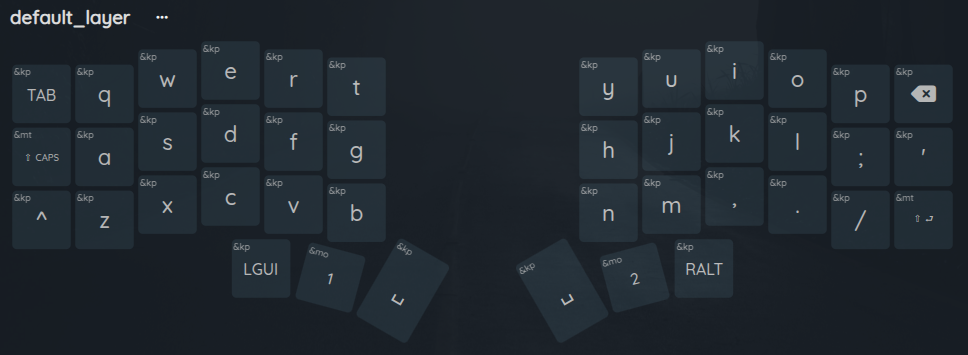
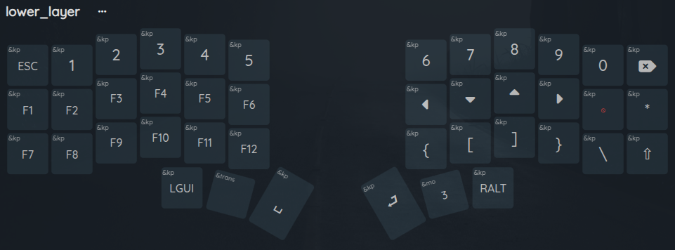
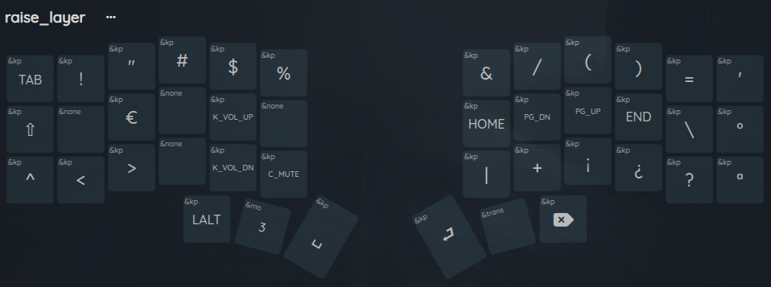
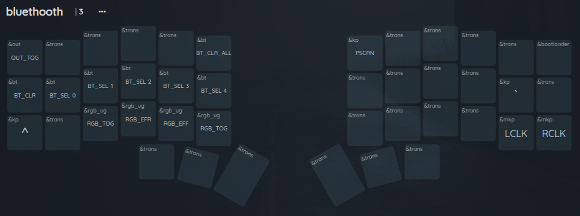
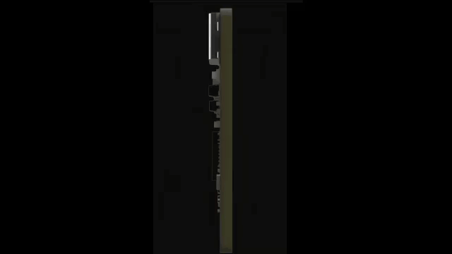

# CONFIGURACIÓN ZMK TECLADO CORNER
[Editor en linea codigo ZMK](https://nickcoutsos.github.io/keymap-editor/)
## KEYMAPS

#### LAYOUT-DEFAULT

#### LAYOUT-LOWER

#### LAYOUT-RAISER

#### LAYOUT-BLUETOOTH

[Enlace de compra Nice!Nano v2](https://kriscables.com/)

